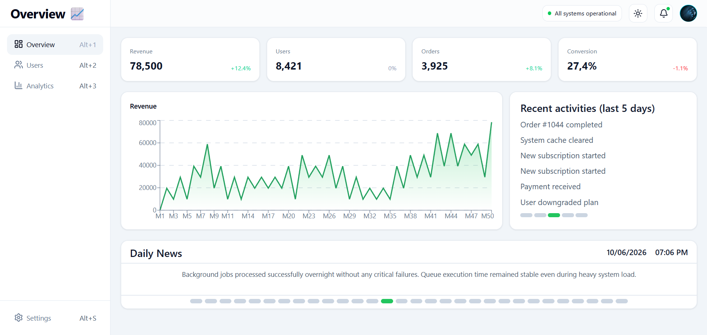
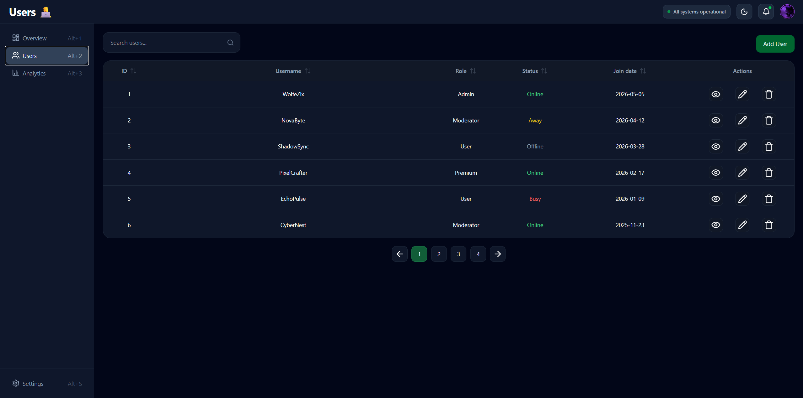
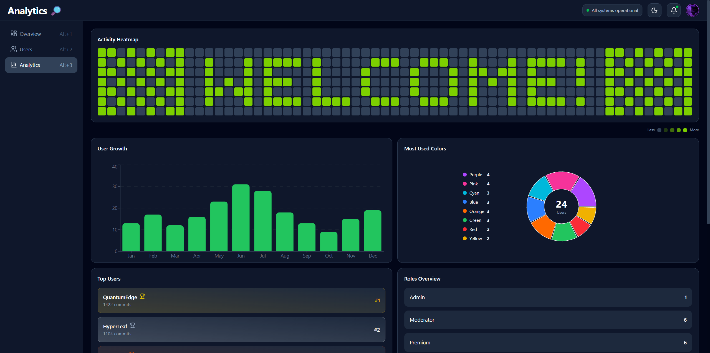
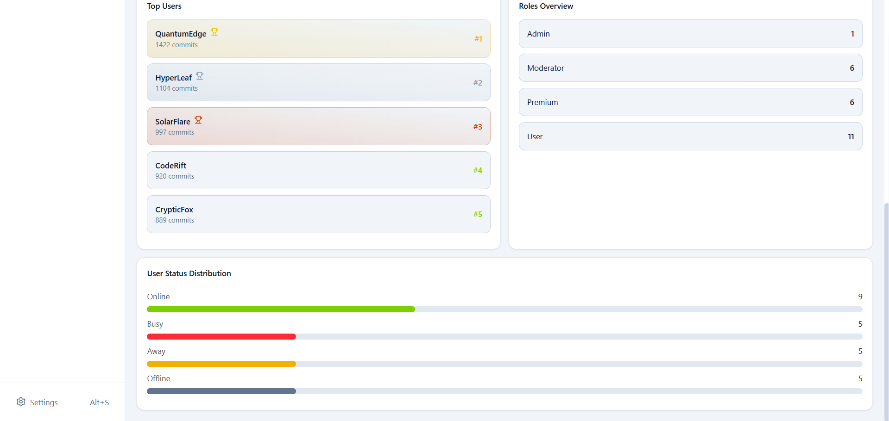
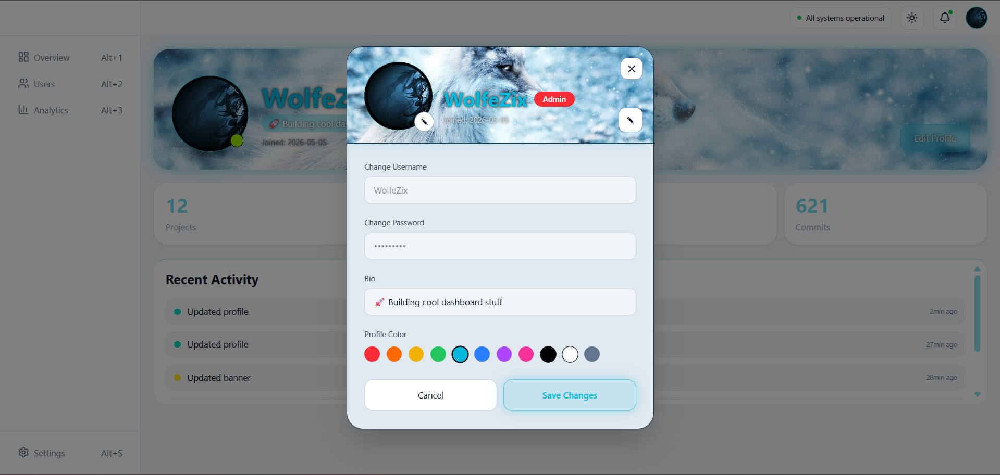
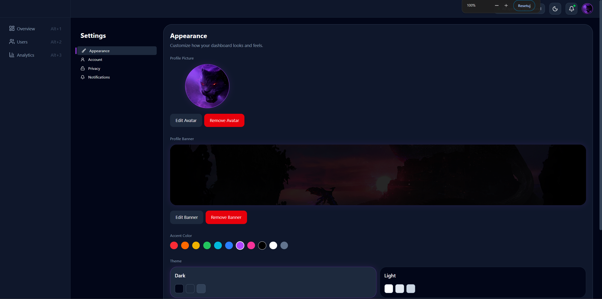
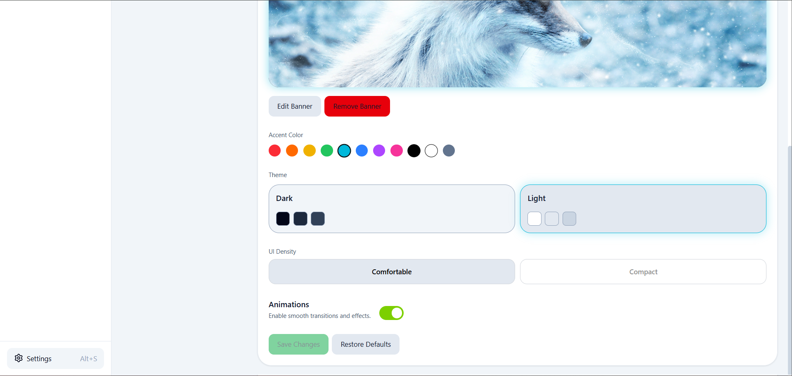
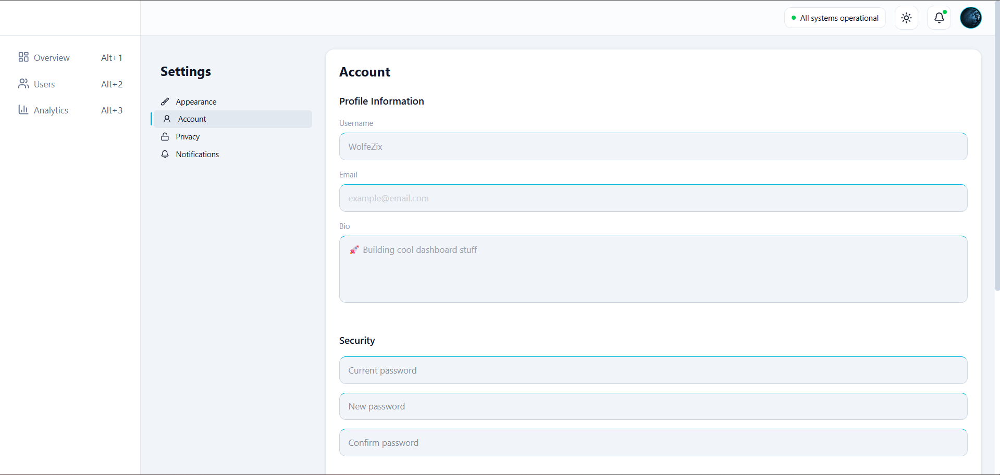
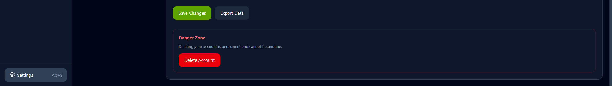

# Dashboard App
A modern dashboard application built with React, TypeScript and TailwindCSS.

---


---

## Live Demo
https://wolfzix.github.io/dashboard

---

## Project Description
Dashboard App is a frontend-focused project designed to simulate a modern administration panel. Users can manage accounts, customize profiles, explore analytics, and personalize the application through a rich settings system.

---

## Features
- User authentication
- User management (CRUD)
- Role-based permissions
- User profiles
- Appearance settings
- Account settings
- Export profile data into JSON file
- Dark / Light theme
- Compact / Comfortable mode
- Analytics dashboard
- User activity history
- LocalStorage persistence

---

## Tech Stack
### Frontend
- React
- TypeScript
- React Router
- TailwindCSS
- Context API

### Data Storage
- LocalStorage

---

### Charts
- Recharts

---

### Deployment
- GitHub Pages

---

## Architecture
The application uses:
- Context API for global state management
- Service layer for data access
- Reusable UI components
- Custom hooks for business logic

Flow:
Components -> Contexts -> Services -> LocalStorage

---

## Pages

### Overview
Dashboard summary, statistics and daily news.


### Users
User management with search, sorting and pagination.


### Analytics
Charts and user statistics.



### Profile
User profile customization and activity tracking.


### Settings
Account, appearance, privacy and notification settings.





---

## Installation
```bash
git clone https://github.com/WolfZix/dashboard.git
cd dashboard
npm install
npm run dev
```

---

## Future Improvements
- Backend integration
- REST API
- Database support
- JWT authentication
- Real notifications, statistics, users and daily news
- Notification and privacy settings
- Activity heatmap based on real user data

---

## What I Learned
During this project, I Improved my skills in:
- React state management
- TypeScript
- Context API
- Component architecture
- CRUD operations
- UI/UX design
- Refactoring large codebases

- Working with reusable components
